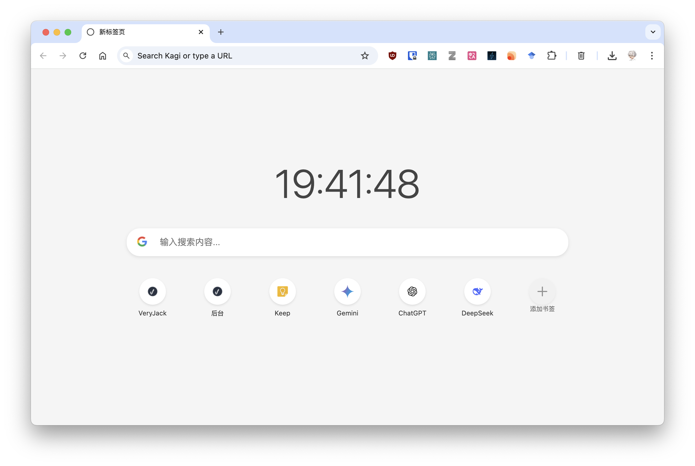

# simple_homepage
简单主页。
Simple Homepage

使用 Windsurf 制作的 Chrome 浏览器简单主页。
A simple homepage for the Chrome browser, made with Windsurf.

没有花里胡哨的效果，就只显示时间、搜索框和书签。
It has no frills, just the time, a search bar, and bookmarks.

## 使用方法
1. 下载[插件](https://github.com/very-jack/simple_homepage/releases)
2. 打开Chrome浏览器
3. 在地址栏输入：chrome://extensions/
4. 确保右上角的"开发者模式"已开启
5. 将下载的 `.zip` 文件拖入浏览器安装即可
